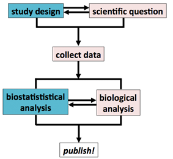

[Return to the table of contents](index.html)

********************************************************************************

Introduction
========================================================

Who is the audience?
-----------------------

Welcome to the UCSF online biostatistics primer. In this first module, I’ll introduce myself and the course, explain why we’re presenting the course in this format, and tell you what you can expect to get from these modules.

These modules have been created to meet the needs of people who:

* work in biomedical research (molecular biology, genetics, computational biology, clinical trials, and epidemiology)
* have little or no formal training in statistics, or have forgotten what they knew
* need a working knowledge of the elements of biostatistics

The goal of these lessons is to provide a quick overview of the essential biostatistical ideas and tools required to work as a biomedical reseacher. The expected audience is someone who will be doing biomedical research, or who will need to read the biomedical research literature critically, but who has not had formal training in biostatistics. 

This describes a very large percentage of the people who work in science and medicine.  Graduate training curricula are packed with material, and not everyone will have the time to take a semester-length course on introductory biostatistics. That said, I strongly recommend that everyone watching this video take a semester-length course in introductory biostatistics. 

It would be ideal if everyone who works in clinical, basic, and translational research could obtain rigorous, formal training in biostatistics. For those who cannot do so, working through these modules will allow for a quick overview of what he or she needs to know to plan studies, think through analysis, and read the literature critically. It is my hope that this quick start will make it easier for you to take the next steps to educate yourself or get through a formal class. Although statistics is a form of mathematics, and much of the statistical literature is impenetrable to those without mathematical training, we will limit the use of mathematical notation in these lectures to the places where I think it is essential.

Biomedical research needs statistics
================================================================================

*"If your experiment needs statistics, you ought to do a better experiment."*

-- Ernest Rutherford, Nuclear Physicist

Biomedical researchers ask widely divergent types of questions:

* Does carrying a rare mutation affect a person's chances of developing skin cancer?
* Why is a strain of influenza resistant to a particular antibiotic?
* What novel dangers to public health are posed by electronic cigarettes?
* Is a new hypertension drug superior in effect to the current standard of care?
* Does a particular protein play a crucial role in the cell cycle?

Biomedical research is fundamentally a challenge of *reverse engineering*: understanding the composition and operating rules of organic life forms we did not create. We have a limited understanding of what the parts of a cell can do in isolation or when interacting with each other. Organic life forms never exist as identical copies, and vary in their behavior and composition over time. Biomedical research tools and methods are indirect, inexact, and expensive. Studies in human populations can take years to complete.

These challenges necessitate a powerful tool for reasoning about the world in the face of uncertainty and variability. In this short course, we will describe how biostatistics is fundmental to two tasks in biomedical investigations: **description** and **inference**. Organic systems vary in their attributes, behavior, and response to perturbation. Biostatistics provides methods to *summarize* these attributes, describe *how confident we are* in these summaries, and *make inferences* about the attributes. 

**Biostatistics is a set of mathematical approaches to producing descriptions of the natural world and inferences about how it works, in the face of natural and measurement variation**. Biostatistics cannot answer definitively whether a biological hypothesis is correct or not. Statistical approaches can, however, provide a principled answer to key questions related to design and interpretation of biomedical studies: 

* How should I design an experiment that is likely to produce an informative result?
* How can I summarize the data I have collected?
* Do the values of measurements I have made have a relationship suggesting they are associated with each other?
* Did an intervention have an effect?
* What what was the size of that effect?
* How does the result of my experiment affect the evidence that a particular model is likely to be true?

Statistics is crucial both before the experiment or trial is performed, for interpretation of the results. Students and trainees often encounter the role of biostatistics in experimental design when they are required to decide how many subjects are required for an experiment. Fellowship and grant applications routinely require this kind of analysis for work involving people or vertibrates: why are you using 30 mice per experimental arm? Please justify why could not do an informative experiment using only 10 mice? How many patients must be enrolled in the trial to have a realistic hope of seeing a meaningful effect? These questions about experimental design require statistical power analysis. We will describe the essential ideas and practical details later in the course. The elements of description and inference are familiar to many people because even without the machinery of statistics, we perform these actions at work and in our daily life. 

The black box of biostatistics
-------------------------------------

If you've never studied the fundamental ideas, biostatistics can seem to be something of a black box. You know that experiments generate data, and some kind of test has to be done to determine whether the data are meaningful, but at that point things get fuzzy. For some people in this position, biostatistics is a cross between a complicated cookbook and a punishment. 

Your ability to design and understand your own experiments is contingent on a working understanding of biostatistics. Your ability to understand and evaluate other people's experiments is also contingent on a working understanding of biostatistics. When studied in isolation, biostatistical analysis may feel somehow separated from the experimental practice of biology, it might feel like something to be gotten over with, before moving quickly back to the bench or the field. This is unfortunate, because biostatistics is a fundamental part of the scientific method. 

I’m going to argue that biostatistics is actually part of the entire scientific process. Waiting until the last moment to apply biostatistical analysis sets you up for a phenomenon described by Ronald Fisher, one of the heavyweight champions of statistics: 

> "To consult the statistician after an experiment is finished is often merely to ask him to conduct a post mortem examination. He can perhaps say what the experiment died of." - Ronald Fisher

The abstract of the paper is a typical example of how biomedical researchers encounter statistics in the wild. This paper in the New England Journal of Medicine reported a phase three trial of vemurafenib, a drug proposed to provide a survival benefit for patients whose tumors have a particular mutation. Patients with metastatic melanoma were selected for treatment because their tumor possessed the targeted mutation, and they they were randomly divided into two groups to receive either drug or placebo. At the end of the trial, patient survival was summarized and a statistical test was performed to determine whether the difference in survival was meaningful. This test produced a *P* value. *P* values are an important and poorly understood concept, and they are everywhere. Most people who start working in biomedical research without a formal training in statistics know that it is good when *P* values are low, and there is something mystically important about a magic number called 0.05, but they don’t have an intuitive grasp of what a *P* value means and the difference between statistical significance and biological significance. It is my hope that after hearing these lectures you will have a firm intutive grasp of what a *P* value is, what it can tell you, and, importantly, what it cannot tell you.

Biostatistics is a powerful and flexible tool that requires practice. Just showing you a box of carpentry tools and holding up a saw or a power drill to point out the pointy bits and the idea behind their use will not teach you how to build a table from raw wood. An instructor can describe how to listen for a heart murmur or perform oral gavage on a mouse, but real understanding comes from picking up the instruments and trying it out. However, many people for whatever reason do not get formal training and practice with these powerful but complicated tools. They have been thrown into the deep end of the pool, trying to understand statistical analysis without clear direction and examples. With those contraints in mind, these modules are meant to give the most essential elements that a biomedical researcher will need to get started. Hopefully, when it comes time to do real work, the material you see and practice here will give you enough of start that you will know what questions to ask, and will give you the context to recognize ideas and methods well enough to get the experience and help you need.

Cultural conventions in statistics
--------------------------------------------------------------------------------

Statistical training emphasisizes formal methods and analytic rigor. Developing and practicing conservative methods, in the sense of "methods that err on the side of not making false claims", are rewarded. Applying newly developed methods to real data is important but in many ways secondary to formal proofs of correctness. It is routine for review of statistical manuscripts to take months; although things are changing, the statistical literature moves relatively slowly compared to the biomedical literature. 

In some ways the biostatistician is similar to biomedical researchers who develop new research technologies: they produce something of great importance to the broader community, but they’re generally looking for someone with data and an interesting problem domain to partner with in order to apply their new method. 
Biostatisticians routinely work on applied problems and can have extensive domain knowledge. 

Statistical training makes extensive use of simulation during methods development. This isn’t because statisticians are too lazy to collect real data; when creating a new method, it is important to have control over the data that are being tested in order to make well-founded conclusions about the properties of the method. At the same time, simulated data can lack the richness and problematic quirks of real experimental data, and an over-reliance on simulated or historical data sets can obscure how expensive and difficult it is to obtain new data. This is one reason I always advocate that biostatisticians get their hands dirty collecting real data in their domain of interest, so they can see how the sausage is made an get an appreciation for what goes into producing the raw materials of their analysis.

A typical statistical talk briefly introduces a problem, describes earlier work in the area, explains the approach, shows mathematical justification for that approach, shows how the analysis is applied to simulated data, and then applies the approach to a data set from the natural world. Statistical analysis can generally be repeated with relatively little cost. A single general computational infrastructure such as a shared computational cluster can be applied to most statistical tasks, eliminating the need to obtain costly reagents or specialized instrument time. Many statistical analysis can be conducted on an ordinary laptop computer.

An overview of the topics covered in these modules
================================================================================

Sampling from a population and designing investigations
--------------------------------------------------------------------------------

Descriptive investigations, also called observational studies, are fundamental to the scientific process. When a new aspect of biology is uncovered, or a new technology allows for novel investigations, the first work is often simply asking, "what can be seen here?" Because we cannot exhaustively measure a property such as "the age of people living in San Francisco" or "the DNA mutations present all kidney tumors", we are generally forced to make do with observing a small set of the total population. Gathering these sample data allows us to *estimate the attributes of the entire population* by extrapolating from properties we observe in our sample to the entire population. 

Although some of the variation we observe is due to natural variance in the population we are studying and random effects, other variance is due to *systematic bias*. Some of the unwanted variation can be mitigated by careful experimental design. Experiments can be broadly classes into those which observe the world without attempting to modify things, and those which deliberately intervene to test a hypothesis about the consequences of the intervention.

Sampling, and the problems of *sampling bias* and *confounding* that can accompany sampling, are introduced in [Module 1.2: Sampling and sources of error](module_01.2.html).

There are several ways to design observational studies, including *cohort designs* and *case-control studies*. These study designs are introduced in [Module 1.3: Observational Studies](module_01.3.html). There are numerous caveats to information gathered in observational studies, but for many aspects of human biomedical studies they are essential and may be the only type of study possible.  

Models are fundamental to science because they allow us to test our observations against a prediction derived from the model, and to predict the outcome of an experiment not yet performed. Molecular biologists often work with informally specified models, such as "When normally functioning TP53 protein is activated in a cell by exposure to high levels of ionizing radiation, this activation causes TP53 to act directly to increase levels of the protein p21 by increasing production of p21 mRNA, leading to cellular senescence and apoptosis. If I deactivate TP53 protein by mutating it, radiation exposure should no longer result in an increase in p21 protein levels".

As we develop models for how the world works, these models can be tested by controlled interventions into natural systems. These interventions may be artificial, as in a laboratory study or a randomized controlled trial. They may also be natural experiments, such as the transmission of rare mutations through families that are linked to the occurrence of a disease. We can use natural and artificial interventions to ask whether there is evidence to support causal relationships. We will discuss causal analysis briefly in philosophical and practical terms, but for now it is enough to state that we are often interested in causes and effects. The connection between choice of study design and causality is introduced in [Module 1.4: Causality and Interventional Studies](module_01.4.html).

Doing statistics with R
--------------------------------------------------------------------------------

Any non-trivial statistical analysis will be done using some kind of statistical software. There are several professional statistics packages that have been around for many years, including SPSS, SAS, STATA. Most of these tools have drop-down menus with the various commands organized in categories. A large number of biostatisticians use another program, called R. In [Module 2.1: Just enough R to get started](module_02.html), I explain just enough about R that someone with no experience could download R and use it to complete the exercises in these modules. 

Exploratory Data Analysis
--------------------------------------------------------------------------------

Biostatistics offers tools to describe the overall properties of our sample. The different kinds of data that we can gather and techniques for summarizing them using numbers and pictures are introduced in [Module 3.1: Data types](module_03.1.html) and [Module 3.2: Exploratory Data Analysis: scatter plots and histograms](module_03.2.html). These techniques include numbers such as the average (statisticians usually say "the mean", as there are several measurements that can be called the "average") and pictures such as a histogram.

In addition to summarizing the primary characteristics of our observed data, a key property of the data is how much variability they possess. Variability has many possible sources: some of it derives from biology, some from experimental inaccuracies or error, and some from random chance occurrences. [Module 3.3: Histograms and variance](module_03.3.html) introduces formal measures of variance. 

Probability and hypothesis testing
--------------------------------------------------------------------------------

Probability quantifies the likelihood that an event will occur. In [Module 4.1: Probability and the P value](module_04.1.html) I describe the elements of how we can use the mathematics of probability to reason about simple random events like coin flips and dice. This section culminates in an intuitive explanation the *P* value. 

Measurements and responses to interventions are a mixture of deterministic predictable effects and random chance. Testing even individuals that seem identical, in rigorously controlled conditions, such as genetically identical cells in a plastic dish in a laboratory, will produce different responses to the same stimulus. Through repeated testing of the system, we attempt to identify consistent models that explain what we observe and predict responses to new interventions. Because living systems are so variable in their individual manifestations and in their response to perturbations, informal models are necessary but insufficient for scientific reasoning. The data we collect in a study must be subjected to some form of formal testing to establish the likelihood that, if our model were incorrect, the data would still appear to be the same. In [Module 4.2: Making decisions with P values](module_04.2.html) I introduce the hypothesis testing framework that is widely used in biomedical science. I also explain some critiques and limitations of the *P* value. [Module 4.3: Adjusting P values when there are many tests](module_04.3.html) explains the intuition behind multiple test correction, and introduces control of the Family-wise Error Rate and False Discovery Rate as means to cope with multiple tests. The hypothesis testing framework is critical to perform power calculationsrequired to answer questions about study design and interpretation.

Building models and using data for decisions 
--------------------------------------------------------------------------------

A biostatistical model usually takes the form of an equation. The equation can have constant values as well as variables with coefficients (multipliers in front of the variables). There are several fundamental models that have been widely studied by statisticians because they are useful for describing a wide variety of real phenomena. The precise values for the constants and coefficients are personalized to a particular set of observations. 

When the validity of a causal relationship is unknown and subject to variation, our reasoning can be aided by *statistical inference*. Statistical inference is the application of observed data to statistical models of the real world with the goal of learning how well the model describes the world. The choice of a statistical model, and its interpretation, are influenced by (and may influence) the scientific model for how the world works. 

In a useful "big picture" article, the statistician Robert Kass defines statistical thinking the following way:

1. Statistical models of regularity and variability in data may be used to express knowledge and uncertainty about a signal in the presence of noise, via inductive reasoning.
2. Statistical methods may be analyzed to determine how well they are likely to perform.

[Robert Kass, *Statistical Science* 2011](http://www.stat.cmu.edu/~kass/papers/bigpic.pdf)

Kass's first point emphasizes that statistical models quantify both knowledge *and* uncertainty. His second point emphasizes that we can prospectively or retrospectively predict the performance characteristics of a model, given the assumptions that it makes and the data we apply.

Applied biostatistics provides practical tools to make observations about the differences between samples. These differences may arise naturally, without our intervention, or they may be the result of deliberate choices made to affect the system we are studying. Many of the same statistical tools can be applied to both of these cases.

When statisticians say they are "fitting a model to data", they mean they are chosing the appropriate model and then estimating the optimal values for the constants and coefficients, given the observed data that were gathered. Introductory textbooks tend to make this process appear bloodless and straightforward, but in the real world fitting a model often involves difficult decisions with no obvious correct answer: which type of model to use, trade-offs between accuracy and generality, decisions about the appropriate number of terms, and decisions about which implicit assumptions are reasonable, etc. Mathematical tools such as the normal distribution, introduced in [Module 5.1: Statistical distributions: uniform and normal](module_05.1.html) 

When we estimate a descriptive value such as the average of a set of values, we also need a way to quantify how accurately we have estimated that average. The accuracy of the estimate will be influenced by the variability of the underlying population-- values that vary a lot from subject to subject are harder to estimate accurately than values that hardly change between subjects-- and by the number of subjects we observe. Statistical tools for estimating the accuracy of our summary values are introduced in [Module 5.2: Quantifying the confidence of an estimate](module_05.2.html) 
Student's *t* distribution, an important tool for analysis of smaller samples, is introduced in  [Module 5.3: Small samples and Student’s t distribution](module_05.3.html). We then go use the *t* distribution to compare the difference between the average value of two groups in [Module 5.4: The t test: comparing the mean between groups](module_05.4.html)

Relationships between variables
--------------------------------------------------------------------------------

In [Module 6.1: Comparisons between two continuous variables: correlation](module_06.1.html) I describe calculation of the correlation coefficient. In [Module 6.2: Comparisons between two continuous variables: linear regression](module_06.2.html) I give a short introduction to linear regression, comparing and contrasting it with correlation.

Counts and categories
--------------------------------------------------------------------------------

Data that deals with the frequency of events takes the form of counts. Special tests introduced in 
[Module 7.1: The Binomial, Chi-squared and Fisher's Exact tests](module_07.1.html), 
[Module 7.2: The Poisson distribution](module_07.2.html), and
[Module 7.3: ANOVA](module_07.3.html) are useful for understanding the properties of data from counts.

Robust and reproducible statistics
--------------------------------------------------------------------------------

Sometimes, unusual extreme observations or technical errors can skew the results of a study. Techniques for identifying these extreme observations, called *outliers*, as well as robust methods that can mitigate their influence, are introduced in [Module 8.1: Robust statistics and Outliers](module_08.1.html)

Students who train in molecular biology learn the central role of a **research notebook**. 
Adequate record-keeping is crucial while experiments are performed, when experiments are written up for publication, and at subsequent points to inform the experimenter, his or her colleagues, and others what was done. UCSF policy requires a written notebook be kept available. The same is true for statistical analysis. Tools and methods introduced in [Module 9.1: Reproducible statistical analysis](module_09.1.html) make it easier than ever to perform reproducible analysis.

