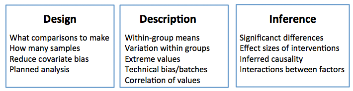

*This module introduces biostatistics as a tool to for describing the natural world and evaluating inferences about how the world works, in the face of natural and measurement variation. It describes how biostatistics is used by different kinds of research workers, and differences in the traditions and practice of statisticians, epidemiologists, and molecular biologists.*

Why do we need biostatistics?
==================================================

*"If your experiment needs statistics, you ought to do a better experiment."*

-- Ernest Rutherford, Physicist.

Biologists and clinical researchers are engaged in a reverse-engineering problem: how do complex systems that were not designed by humans function? How can we modify those systems? Biomedical research (a term I will use to include research into molecular biology, genetics, computational biology, and epidemiology) presents a fundamentally different challenge from engineering or mathematics.

Organic life forms:

* are made of many parts which interact in complex ways 
* never exist as identical copies
* vary in their behavior and composition over time
* are subject to a mixture of invariant natural laws and random chance. 
* are too numerous to measure exhaustively

Biostatistics is a key tool for coping with this variation. In this short course, we will describe how biostatistics allows two of the fundmental tasks in biomedical investigations: **description** and **inference**. Organic systems vary in their attributes and behavior. Biostatistics provides methods to summarize these attribues and to describe how confident we can be that our summaries reflect the true state of the world. 

Sampling from a population
---------------------------------

In tiny populations where members have a fixed characteristic we may be able to exhaustively catalog whole population. How many first-year students who started graduate programs at UCSF in 2015 reported that they were male? To answer this question we can obtain the records and count: of 933 students, 597 were female (*source: UCSF News Center*).

We often would like to describe and make inferences about whole categories of distinct entities: all women with endometriosis, all lung tumors, all astrocytes in adult mice. This forces us to sample from a population, selecting a subset of all members of the population to get a picture of the whole. Biostatistics offers guidance for questions such as:

* How many samples must I take to get a stable estimate of some property in the population?
* How does my confidence in an estimate of the population change if I make my sample larger?
* What other properties might be associated with the phenomenon I'm investigating?

As an example, consider the question, "what is the height of a typical adult living in San Francisco?" If we stood at Market and Van Ness streets and somehow convinced passers-by to let us measure their heights, how many people would we need to measure? Would 10 people be enough? Or 100? Would we get different results if we measured on a street in Chinatown, or out in Seacliff? Deoes the sex of the individuals I sample influence my answer?


Variation in measurements
---------------------------------

Measurement variability can be demonstrated by distributing short rulers to a group of people and asking them to measure the length of a long hallway. Everyone will come up with slightly different results. Measuring the length of a hallway is much easier than most tasks in biomedical research, as the hallway and rulers remain constant in their size. Most biological assays are attempting to use a nosier measuring stick on a moving target. 

Biostatistics allows comparison
-----------------------------------------

Descriptive investigations are fundamental to the scientific process. When a new aspect of biology is uncovered, or a new technology allows for novel investigations, the first work is often simply asking, "what can be seen here?" However, deeper insights typically derived from forming a models that might explain the natural world and then testing tehse models.

As we develop models for how the world works, these models are tested by controlled interventions into natural systems. These interventions may be artificial, as in a laboratory study or a randomized controlled trial. They may also be natural experiments, such as the transmission of rare mutations through families that are linked to the occurrence of a disease. We can use natural and artificial interventions to ask whether there is evidence to support causal relationships. We will discuss causal analysis briefly in philosophical and practical terms, but for now it is enough to state that we are often interested in causes and effects:

* Does carrying a rare mutation affect a person's chances of developing skin cancer?
* Is a strain of influenza resistant to a particular antibiotic?
* Is a new hypertension drug superior in effect to the current standard of care?

Measurements and responses to interventions are a mixture of deterministic predictable effects and random chance. Testing even individuals that seem identical, in rigorously controlled conditions, such as genetically identical cells in a plastic dish in a laboratory, will produce different responses to the same stimulus. Through repeated testing of the system, we attempt to identify consistent models that explain what we observe and predict responses to new interventions.

**Does a new drug kill cancer cells?**

I am designing an experiment to determine whether a drug would be likely to benefit patients whose have a tumor that bears a particular DNA mutation. To model cancer in a human patient, molecular biologists can isolate cells from a patient's tumor and grow them on plastic dishes. The cells, fed appropriate nutrients in a defined medium, will continue to divide indefinitely. The cells are meant to model what is going on inside of the tumor from which they were derived. The drug of interest may kill the cells, or it may do nothing. 

This example is one of the most carefully controlled situations in biomedical research. The population under study is a single-celled organism that lives in a temperature- and atmospherically-controlled incubator, consuming only nutrient broth we supply. The stimulus will be precisely measured drug stimulus given at the time and dose we choose. Drugs can be formulated by a single person and all organisms are treated under the same regime. By starting with a single cell and growing out a colony of replicate cells, it is possible to reduce the genetic and inter-subject variability compared to studying natural populations of organisms. 

The process is to seed the same number of cells into plastic dishes and treat the cells with either drug or a placebo, usually the liquid into which the drug was dissolved. The experimenter then waits and counts the number of viable cells under each condition.


Naively we might imagine that a single test can be performed: split a dish of cells in half, treat with either drug or vehicle, and count the number of viable cells in each dish. 

This project is fraught with unintended variability. Some of the obvious sources:

* The number of cells starting in each dish is different. 
    + This will affect any perceived change in cell population after treatment
    + This will have more subtle effects since the cell's growth is affected by the population density and chemical substances secreted by its neighbors.
* The internal state of the cells is not identical. 
    + At any given time point, cells will be in different phases of the growth cycle
    + Cells are exposed to varying levels of nutrients and drug.
* The population measurements counts are imprecise. They are typically performed by extracting a small volume of cells from the whole dish and attempting to count the number of cells in that small sample.
* The cells themselves will not remain genetically identical; they constantly undergo DNA damage, leading to sub-populations that grow at distinct rates and react distinctly to stimuli.

As a result, we will find that if we repeat the experiment more than once, we will report different answers.


```{r echo=FALSE, fig.width=5, fig.height=4}
veh =  c(123882,106883,50919,74551,118046,38686,132710,87012,110617,89205)
drug = c(81399,59396,77027,29396,40791,40224,48185,54700,50314,67893)
results = 1:20
results[ seq(from=1, to=19, by=2) ] = veh
results[ seq(from=2, to=20, by=2) ] = drug
colors = rep(c("black", "cornflowerblue"), 10)
barplot(results, col=colors, space=c(0, 0,1,0,1,0,1,0,1,0,1,0,1,0,1,0,1,0, 1, 0),  
        xlab="replication", ylab="number of cells", ylim=c(0, 166000), axes=FALSE )
lbls = c( "0", "2e4", "4e4", "6e4", "8e4", "1e5", "1.2e5", "1.4e5" )
axis(2, at=seq(from=0, to=140000, by=20000), labels=lbls, las=1 )
axis(1, at=seq(from=1, to=30, by=3), labels=1:10, las=1 )
legend(22, 1.65e5, c("Vehicle","Drug"), col=c("black", "cornflowerblue"), pch=19)

```

Here the height of each bar represents the number of cells remaining in the petri dish after treatment with vehicle control (black) or drug (blue), in 10 repetitions of the experiment. In replication five it appears that there is a convincing effect of the drug on cell viability. However, replication six shows no apparent effect. Which is the correct answer? Intuitively, if we look across the experimental results, it appears that black bars are generally taller than their blue counterparts. However, some replications would show no effect. 

Replication is a fundamental element of biostatistical analysis. 

Biostatistics is a set of mathematical approaches to producing descriptions of the natural world and inferences about how it works, in the face of all of these sources of variation. **Biostatistics cannot answer definitively whether the drug kills cells**. Statistical approaches can, however, provide a principled answer to ask the question, if our hypothesis were wrong, how likely is it that we would see data like these?

Biostatistics is used to answer the key questions related to these studies: 

* How should I design an experiment that is likely to produce an informative result?
* How can I summarize the data I have collected?
* Do the values of measurements I have made have a relationship suggesting they are associated with each other?
* Did an intervention have an effect?
* What what was the size of that effect?
* How does the result of my experiment affect the evidence that a particular model is likely to be true?




Cultural conventions in biology vs. statistics
========================================================

In addition to the obvious differences in the working process of statisticians and biomedical researchers, there are less obvious cultural differences in how these two groups are trained and work. Although these differences are not absolute, they are worth bearing in mind:

Statistical training
-----------------------

Statistical training places an emphasis on formal methods and analytic rigor. Statistical methods are developed in a framework made by humans. Applying newly developed methods to real data is important but in many ways secondary to formal proofs of correctness. Statistical training makes extensive use of simulation during methods development. A typical statistical talk introduces a problem, describes earlier work in the area, explains the approach, shows mathematical justification for that approach, shows how the analysis is applied to simulated data, and then applies the approach to a data set from the natural world. Statistical analysis can generally be repeated with relatively little cost.

Some statisticians are intensely mathematical and rarely are exposed to the details of the domains where their work is applied, while others work routinely on applied problems and have extensive domain knowledge. 

Biological training
-----------------------

Although there are scientists who work on theoretical topics-- evolutionary biology is one such area-- the majority of biomedical research is relentlessly empirical. Biologists and epidemiologists are reverse-engineering systems made by evolution. Biological research is often motivated in part by intuition and a "feel for the organism", rather than formal logic. Biomedical researchers are rewarded for the ability to work with incomplete data.

Experiments are often expensive in time and money, and generally speaking it is far more expensive to do experimental work than statistical work. Even seemingly simple laboratory experiments can require extensive infrastructure: $10,000 freezers, high-speed centrifuges, protein antibodies, cell medium, disposable plastic material, etc.  Studies of human populations are often constrained by the availability of patients who are willing to donate tissue and by ethical constraints about what tissue can be collected and what treatment and biopsy procedures are in the best interest of the patient.

A consequence of these constraints is that biologists tend to want to wring every possible piece of information out of their work. A biologist may be comfortable setting up a study with few subjects when a statistical analysis suggests it is unlikely to produce a well-substantiated result, or testing a large number of possible variables with a small number of samples. Faced with a choice between doing no experiment and learning nothing, and doing an experiment bearing a small chance of success, many biologists will forge ahead. Rather than recoiling and declaring the results uninterpretable, biostatististicians can make sure the study is interpreted realistically.  

