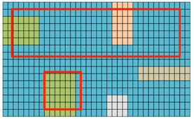

[Return to the table of contents](index.html)

********************************************************************************

What you'll learn in this module
=================================

* Estimating properties of a population with a sample
* The impact of sample size on estimation
* Sources of error
    + Random error
    + Bias
    + Confounding


Sampling from a population
================================================================================


How can we study very large groups?
-------------------------------------------

Although in everyday language a "population" usually means a set of whole organisms, usually people, a population can really be any set of things we'd like to know more about. Examples of populations include:

* all women with endometriosis
* all lung tumors arising in non-smokers
* all astrocytes in adult mice

We often would like to describe and make inferences about populations, whether these populations are individual humans, tumors, cells, or something else. Questions about the characteristics of small populations can sometimes be answer by exhaustively cataloging all of the members. How many first-year students who started graduate programs at UCSF in 2015 were recorded as being female? We can obtain the records and count: of 933 students, 597 were female (*source: UCSF News Center*). How many of those students currently have a Body Mass Index exceeding 25? It would be possible, though time-consuming, to ascertain the answer to this question by measuring all of the members of this group.

We might instead pose a more general question: How many students who enrolled in a graduate program in California in 2015 have a BMI above 25? What about in the entire United States? Now the question cannot be answered by simple counting. We cannot survey all of the people in this category. We are forced to **obtain a sample of subjects from the population, and hope that this sample is representative of the whole population**. We know the overall population is not uniform. The degree of variation is often unknown. There are likely to be unforseen hidden effects and subjects with unusual properties that can affect our analysis. It costs money, time, and effort to obtain samples, so we need to be as efficient as we can. Determining how to sample from the population is not a trivial matter.

Biostatistics offers guidance for questions that should arise:

* What **sample size** is required to obtain a useful estimate of some property in the population?
* How does my **confidence** in an estimate of the population change if I make my sample larger?
* How can I obtain an accurate estimate when the population contains groups that systematically vary in some way that will affecy my estimate?


**Figure 1: A sample is meant to represent a population**

The blind men and the elephant
---------------------------------------

There exists an old fable about six blind men. In the story, six blind men encounter an elephant. These men have never heard of elephants before and they don’t know what they have found. To learn more about what an elephant is, each bravely walks up to the animal in turn and touches a different part of the elephant. 


**Figure 2: Sampling from a very large, grey population**

Each man reports what he finds during his investigation. Since each has sampled a different part of the animal, each man reports a very different impression: "it's like a spear", "it's like a wall", and so on.

The exact nature of the sample each man has taken varies so dramatically that no one is getting a clear understanding of the nature of an elephant.


**Figure 3: Repeated sampling gives different results**

We can intuitively grasp that taking a larger and larger sample would be likely to give a more complete and representative picture of the whole population. It is also clear that if we were to repeatedly take smaller samples and then somehow integrate our observations into a unified picture, we could also get a good overall picture of the population.



**Figure 4: Larger samples tend to better reflect the population**

In this and subsequent modules I describe in more detail how sample size and method affect:

* confidence in the estimate
* sensitivity to detect effects/trends
* representation of population diversity
* influence of unwanted covariates

Demonstrating the effect of larger sample sizes
---------------------------------------

Fortunately, it often isn't necessary to survey all subjects in a population exhaustively to get a very accurate estimate of a property. At one extreme, if the total size of a population is 1000 individuals and we survey 999 of them, the average of 999 samples will be nearly identical to the average of all 1000 samples. The additional information about the population provided by the very last person who was not surveyed is very unlikely to change our estimate of the population trend. 

To show an example of how the size of the sample affects the accuracy of our estimate for the whole population, I will create an example population from randomly generated data. This is a common technique in statistical analysis, because a simulated dataset allows us to explore the properties of statistical tools in a completely controlled setting.

The plot below shows 1000 randomly generated numbers. These could be the response to some medication, the life-span of frogs, the diameter of the retina; it doesn't matter for our purposes. 

```{r echo=FALSE, fig.height=3, fig.width=4}
par(mar=c(1,3,3,1))
values = rnorm(n=1000, sd=3, mean = 15)
plot(values, axes=FALSE, xlab="", ylab="attribute", ylim=c(0,30), 
     pch=19, col="#0000ff33", main="Population data", cex=0.5)
axis(2,seq(from=0, to=30, by=5), las=1)
abline( mean(values), 0)
text( 500, 0, "Population size: 1000", font=2)
box()
```

**Figure 5: Simulated population of 1000 individuals**

I will introduce a little statistical terminology.
The term **parameter** has a specific meaning for statisticians. A **parameter** is an unknown property of the world that we wish to estimate. Examples of parameters could include 

* average years of survival after heart transplant surgery
* doubling time of cells bearing a mutated copy of the *TP53* gene
* percentage of breast tumors that grow in response to estrogen

A **statistic** is an estimate of a parameter computed from a sample. A statistic could in principle be derived from an entire population, but in our typical experience, statistics are almost invariably derived from a sample of the population. Almost all scientific inquiry is a process of understanding populations on the basis of observing and experimenting with samples.

This set of 1000 values represents the total true population for some measurement. For the moment we'll pretend we can measure without error. The actual average of all 1000 points, rounded to four decimal places, is `r round( mean(values), 4)`. This is the parameter we wish to estimate. In the real world we don't get to see all 1000 points. Every time we take a sample, we will randomly choose a set of these 1000 values and compute the mean of the sample. This value is the statistic. We can show how the accuracy of this statistic, our **sample estimate for the population mean**, varies by sampling this population 100 times at three distinct sample sizes. The point is to show how our estimate of the true population would vary if we did the same experiment over and over again. We'll use sample size of 500, 100, or 10 subjects:

```{r echo=FALSE, fig.height=4, fig.width=8}
layout(matrix(1:3,1,3))
par(mar=c(1,5,3,1))
mus = rep(0, 100)

for(i in 1:100){
    sample_size=10
    mus[i] = mean( sample( values, size=sample_size ))
}
plot( mus, axes=FALSE, xlab="", ylab="estimate of the mean", ylim=c(12,18), 
     pch=19, col="#0000ff33", main="")
axis(2,seq(from=10, to=20, by=2), las=1)
abline( mean(values), 0)
text( 50, 13, "Sample size: 10", font=2, cex=1.5)
box()

for(i in 1:100){
    sample_size=100
    mus[i] = mean( sample( values, size=sample_size ))
}
plot( mus, axes=FALSE, xlab="", ylab="estimate of the mean", ylim=c(12,18), 
     pch=19, col="#0000ff33", main="")
axis(2,seq(from=10, to=20, by=2), las=1)
abline( mean(values), 0)
text( 50, 13, "Sample size: 100", font=2, cex=1.5)
box()

for(i in 1:100){
    sample_size=500
    mus[i] = mean( sample( values, size=sample_size ))
}
plot( mus, axes=FALSE, xlab="", ylab="estimate of the mean", ylim=c(12,18), 
     pch=19, col="#0000ff33", main="")
axis(2,seq(from=10, to=20, by=2), las=1)
abline( mean(values), 0)
text( 50, 13, "Sample size: 500", font=2, cex=1.5)
box()
```

**Figure 6: Sampling from the simulated population with three sample sizes**


In **Figure 5**, I showed you the actual population values. **Figure 6** now shows our estimates of the total population mean; each point represents the statistic calculated from a simulated single experiment.

In the first plot, with a sample size of 10, there is a lot of variation in the sample estimate of the population mean because sometimes we will happen to pick 10 subjects who are not very representative of the population as a whole. In the third plot, our sample size is 500 out of the 1000 subjects in our population. Our estimates tend to be very close to 15, though they vary from the true population mean. 

It is clear that with a sufficiently large sample, we can obtain an reasonably accurate view of the entire population. A key question is, **how many observations must be made to get a useful estimate of the total population**? We would like to predict this value *before* doing the experiment, so we know how many people to enroll in the study or how many mice to breed. This demonstration suggests that for a population of this type:

* larger samples tend to produce more accurate estimates of the mean
* we can predict the accuracy of an estimate for any particular sample size
* individual samples will sometimes be poor representatives of the population

A point I haven't made in this example but will emphasize later, is that the accuracy of the estimate will also be strongly influenced by the total variation in the underlying population.

These questions are relevant both before a study begins, to address the question of how many samples will be required, and after the study is complete, to address the question of how much information we think our estimates of the population can give us. 

Problems in measurement: variation and bias
==============================================

Variation in measurements
--------------------------------------------------------------------------------

An additional difficulty in estimating parameters using samples is that in practice, individual attempts to measure an subject's attribute will produce different answers.  Measurement variability can be demonstrated by distributing short rulers to a group of people and asking them the measure the length of a hallway. Everyone will come up with slightly different results. Measuring the length of a hallway is much easier than most tasks in biomedical research, as the hallway and rulers remain constant in their size. Most biological assays are more akin to using a flexible measuring stick to measure a target that grows and shrinks and won't hold still.

Some measurements will vary depending on who does the measuring. It would seem that the answer to, "Has this patient ever been diagnosed with breast cancer?" is either a yes or no. We might assume that the answer is clear and can be found by consulting the appropriate records, or by asking the patient. However, diagnoses and records are subject to errors. There exists a continum of judgement; some patient's cases will produce near-universal agreement among clinicians, while others will be subject to disagreement. Note the fundamental difference between the question, "Has this patient ever been diagnosed with breast cancer," and "does this patient have breast cancer?" One question explicitly acknowledges our imperfect understanding of the world.

Random error and bias
--------------------------------------------------------------------------------

Biostatisticians often distinguish between several types of error, including *random* error and *systematic* error. Random error is noise that does not have a pattern in common with our experimental question. If you are trying to call someone on a cell phone and sometimes hear static on the line, that static is random error in the connection. Random error may make it harder or impossible to interpret the results by increasing measurement errors. 

Systematic error affects your perception of the world in a way that pushes you to see things in a particular way. A classic example contrasting random with systematic error shows two different kinds of arrow strike patterns in an archery competition (**Figure 7**). The goal is to shoot an arrow into a small circle at the center of a target. The target on the left shows random error: misses are is spread around the target without any pattern. The target on the right shows systematic error: all of the hits are too low and to the left of the target.


**Figure 7: Random error *vs.* Bias**

As a simple example, imagine you are attempting to make an agarose gel for use in DNA gel electrophoresis. This simple laboratory procedure requires measuring out a set quantity of agarose powder (e.g. 2 grams) and mixing it with a defined quantity of buffer solution (e.g. 100 mililiters). You attempt to measure out 100 ml of using a graduated cylinder, which is not a particularly accurate tool but good enough for the purpose. If you make 10 gels, each gel will be made with a slightly different amount of buffer; some slightly less than 100 ml, some slightly more than 100 ml. These differences are random errors. However, let us say you forget to calibrate the balance for the plastic cup in which you weigh the powder, and the previous user had set it for a smaller cup than your own. The scale will report you have 2 grams of material when you only have 1.7 grams; in addition to the *random* error in your buffer, there will be a *systematic* error resulting in too small a quantity of agarose powder for the expected result.

Variation around a statistic can be quantified mathematically using a value called **variance**. Systematic error in that skews a sample estimate from the true population estimate is also called **bias**. An archer who consistently hits a spot in the lower-left corner of the target has high bias (high random error) but low variance. Bias can be measured in theoretical examples where we know the true population values for the thing we are measuring, but in the real world bias may not be discovered until much later, perhaps when a study is replicated in a different population.


Selection bias 
--------------------------------------------------------------------------------

An ideal selection from the population will reflect precisely the relative diversity of the population from which the sample was drawn. If samples are divided into subgroups by some inherent property, such as sex, or a property we impose in our experiment, such as assignment to receive an experimental drug, then ideally the intended splits will be the only meaningful difference between the groups, with all other factors held constant. 

The real world is not ideal.

As an example, consider the question, "what is the height of a typical person living in San Francisco?" If we stood at Market and Van Ness streets and somehow convinced passers-by to let us measure their heights, how many people would we need to measure to get a good estimate? Would 10 people be enough? Or 100? Would we get different results if we measured people walking into Lafayette elementary school? Does the sex of the individuals I sample influence my answer? The unintentional skewing of a statistical question by surveying a sample that does not adequately represent the entire population is called *selection bias*. 

I'll illustrate selection bias with a concrete example. Researchers testing reaction time would like to know how quickly people can respond to a stimulus, so they test a group that is convenient to obtain: undergraduates enrolled at their own research institutution. This is an example of the **convenience sample**: a sample that is chosen because it is easy to get.

```{r echo=FALSE, fig.height=4, fig.width=8}
layout(matrix(1:2,1,2))
par(mar=c(3,3,3,1))
values1 = rnorm(n=900, sd=3, mean = 20)
values2 = rnorm(n=100, sd=3, mean = 15)
vv = c(values1, values2)
colors=c( rep("grey", 900), rep("black", 100))
idx = sample(1:1000)
plot(values2, col="black", pch=19, ylim=c(0,30), las=1, main="Undergraduate sample")
abline( mean(values2), 0)

plot(vv[idx], col=colors[idx], pch=19, ylim=c(0,30), las=1, main="total population")
abline( mean(c(values1, values2)), 0)
```

**Figure 8: Simulated data showing selection bias**

The left side of **Figure 8** represents the observations from the study of the convenience sample, with a horizontal line at the mean observed result. The researchers might conclude from this study that the reaction time for the general population is 15. However, if the study had been performed on sample randomly selected from the overall population, which includes older people who tend to have lower reaction times (grey points), the reported mean would have been 33% higher (right panel).

This example is a case of straightforward sample bias: a single value is being estimated, and estimate is biased from the true population mean because the sample is unintentionally not representative of the overall population. 

The presence of bias in a sample does not invalidate the data that were collected, but it does influence our interpretation of how generally the estimated statistics may be. 

Confounding
================================================================================

When we wish to compare a statistic measured from two different populations, ideally the two populations will be identical except for a single property. For example, we might compare life span in men *vs.* women, wealthy *vs.* not wealthy persons, or persons educated in the US *vs.* those educated in China. A nasty problem called *confounding* can occur when difference in the two population values are influenced by a hidden effect that also co-varies with the two groups. Confounding can therefore throw off our interpretation of the results, either accentuating or masking true differences.

As an example, consider a study examining whether overall mortality is higher in one US state than another. We survey all US states and find the mortality, that is the death rate per year, varies widely. According to the 2014 US cencus the mortality per 100,000 people in Alaska was 542, while in the state of Maine it was 1,019. That's nearly twice as many deaths in Maine.


**Figure 9: Mortality in two US states**

We immediately begin crafting an explanation for this troubling finding. Perhaps the danger posed by polar bears has been wildly overstated, and the proximity to undersea crustaceans found in Maine is the source of all of these deaths. 

However, this silly interpretation becomes less convincing if we ask whether people tend to be the same age in the two states. One of the best predictors of mortality is age, as older people have a higher mortality rate than much younger people. We could check whether age is a confounding explanation for our finding. In this case, we could stratify the populations by age, for example by comparing populations within each decade of age, or we could estimate the effect of age on overall mortality and ask whether there is a meaningful effect after removing the effect of age; this is called an "age-adjusted mortality comparison".


**Figure 10: Mortality in two US states with age adjustment**

After adjusting for age, the mortality rates of Alaskan and people from Maine are nearly identical. There is an eight year difference in the median age of the two states, that is, number at which half of the population is older and half is younger. In this example, age confounds the difference in state of residence.


**Figure 11: Schematic illustration of confounding**

Summary
==========

* Properties of the group (parameters) can be estimated by computing a statistic from a population sample
* Larger samples will tend to provide a more representative estimate
* Sample bias from methods such as convenience sampling or miscalibrated tools affects the sample statistic
* Confounding can occur when an unmeasured factor co-varies with the factors that are being considered as explanatory for a difference in two or more populations

