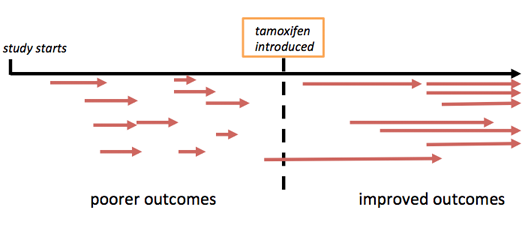
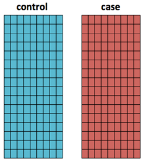

[Return to the table of contents](index.html)

********************************************************************************

What you'll learn in this module
=================================

* Two types of observational studies
    + Cohort studies
    + case control studies
* Evaluating evidence from observational studies

Cohort studies
================================================================================

A fundamental element of study design is whether the experimenter intervenes with the subjects, or instead observes the natural world and draws inferences about the association between exposures and outcomes. Observational studies are common in the field of epidemiology, as many questions about humans at a population scale are intractable except as observational studies. 
The term **exposure**, borrowed from epidemiology, broadly means any factor that could affect the outcome under investigation. Exposures do not have to be exogenous chemicals; in genetic epidemiology, which studies the effect of rare and common variations in our DNA on disease risk, possessing a particular form of genetic variant is an exposure. 

Perhaps the simplest observational study design is to identify a group of subjects who are likely to experience the exposure, and follow their history to see what happens to them over time. Studies over time are called **cohort** studies, or **longitudinal studies**. In this study design there is no intervention to affect the subject's exposure. Cohort studies assess the assocation between some **exposure** and an **outcome** in a group of individuals. In a *prospective* cohort study, the cohort is assembled before individuals are exposed to the factor under consideration, and then the cohort is followed over time. In a *retrospective* cohort study, individuals are sampled after the exposures and outcomes have already occurred, and the association between exposure and treatment is determined looking back in time.

**Figure 1: Schematic of a cohort study**

Examples of two large, successful cohort studies
------------------------------------------

The *Nurses' Health Study* (www.nurseshealthstudy.org) was started in 1976, with the goal of identifying the consequences of oral contraceptives, smoking, cancer and heart disease on women's health. Registered nurses were chosen for the study because they were straightforward to identify, easy to find for follow-up, and able to respond to detailed technical questionnaires. Only married women between 30 and 55 were chosen for this study. Over time the study has grown in complexity and many additional sub-projects have been spun off. 

While the knowledge gained from such a study is tremendous, it is worth noting that this study is also an excellent example of a convenience sample. There may be features of the lifestyle or physiology of women in their early teens or twenties from different socioeconomic or ethnic backgrounds that differ systematially from the original core population of married, middle-aged women.

Another major cohort study was founded in Framingham Massachusetts, with the goal of understanding causes of cardiovascular disease. The Framingham Heart Study (www.framinghamheartstudy.org) enrolled 5,209 adults living in Framingham, a mixture of randomly selected individuals and some volunteers. As the founders of the study recognized, the middle-class caucasian population in Framingham was not representative of all humans. No study is design can be perfect, and this did not prevent the study from contributing a great deal to our understanding of cardiovascular disease and other aspects of human health that have been added to the study along the way.

Environmental confounding in longitudinal studies
----------------------------------------------

**Figure 2: environmental confounding**

If control groups are drawn from distinct regions or countries from the cases, this can impact outcomes due to differences in medical practice, environmental exposures, or other confounding factors. Environmental confounding in a longitudinal study can occur due to events that happen after the start of the study. Over time, the medical and real-world environment can change in ways that affect the outcome of a cohort experiment. An obvious example would be the widespread introduction of an effective new therapy such as the anti-estrogen drug Tamoxifen to the standard of care mid-way through a long-term cohort study experiment; patients who benefit from this new therapy would have better outcomes than patients who developed disease earlier or who were enrolled earler. 

Cohort study advantages and drawbacks
------------------------------------------

**Why perform a cohort study?**

* It may be impossible to control who will be exposed to the factor
* Deliberately exposing people to to something known to be harmful is generally unethical 
* Prospective cohort studies are less vulnerable to sampling bias than retrospective studies, because the outcome occurs after sampling has taken place
* Cohort studies do not require enforcing a individual's decision about exposure

**Disadvantages of a cohort study**

* Cohort studies may take a long time to complete. 
    + Subjects can be more easily lost to follow-up in large studies
    + Large studies are hard to manage and maintain when researchers cannot plan their own careers many years into the future
* Cohorts cannot be randomized to treatment, potentially introducing confounding (see Randomized Clinical Trials in the next module)
* Retrospective cohort studies are susceptible to selection bias
    + In an ideal prospective cohort studies, selection bias due to sampling is lessened because the outcomes occur after the individuals are sampled. 
    + In prospective cohorts, selection bias *can* occur due to differences in loss to follow-up, or covariates associated with self-selection.

Despite the drawbacks and imperfections of a cohort design, studies such as the Nurses' Health study contribute information that cannot be gathered by studying model organisms in a laboratory.

Although cohort studies do not control the number of exposed individuals directly, the size of the cohort will be chosen to reflect features including:

* the expected number of exposures that will occur in a cohort of that size
* the expected number of events, given the expected number of exposures
* the diversity of the cohort
* the anticipated effect size of an exposure

*Power analysis* is the process that calculates the relationship between the size of the study, the size of the effect, and what kind of conclusions can be drawn from those factors.

Case-control studies
==================

The case-control study is a retrospective (backward-looking) study design that measures the assocation between an exposure and individuals with two or more distinct outcomes. 

The outcome of a case-control study is expressed in terms of an odds ratio. The odds ratio expresses the relative odds of an outcome given an exposure, compared to the odds of the outcome in the absence of that exposure. Importantly, the odds ratio is therefore contingent on the choice of control group and the risk present in that group. 

**Figure 3: Cases vs. controls**

Selecting the control group
--------------------------------------------------------------------------------

When asking whether an exposure is associated with or causes an effect, it is of fundamental importance to clearly articulate the answer to the question, "*compared to what*?" In the epidemiology literature, the exposed group is usually called the "cases", while the unexposed group is called the "controls". There are several strategies for selecting human control subjects. In some prospective experiments the control subjects will be pre-selected, allowing the researcher to choose the most appropriate controls available. In cohort studies (described below), the controls are determined after the experiment has ended. 

Any systematic differences between case and control subjects can potentially produce undesirable confounding. Confounding can be harmless if it has no impact on the process under analysis, but confounding factors that can affect the outcome of the experiment are a signifiant hazard. Interventional studies that employ randomization, such as the randomized controlled trial, are designed to minimize this form of confounding (see [Module 1.4: Causality and interventional Studies](module_01.4.html)). Practical considerations strongly influence the choice and number of control subjects. When the ideal controls are unavailable, it is possible to use historical groups of subjects as controls.

In some experimental designs, the subjects play the role of both control and case. One example is a trial to compare two drug's short-term effects; these effects may be strongly influenced by the individual's physiological or genetic background, so the drugs may be given in series to each subject with a wash-out period separating the administrations.

A key difference between case-control and cohort studies is that case-control studies deliberately select cases (exposed) and control (unexposed) subjects, rather than selecting a pool of potential subjects and waiting to see who becomes a case or control. 

**Why perform a case-control study?**

* It may be impossible to control who will be exposed to the factor
* Deliberately exposing people to the factor may be unethical 
* If the data are available, retrospective studies can be carried out much more quickly than cohort studies
* Control over the size and membership of subject groups. 

**Disadvantages of a case-control study**

* Subject to the same kinds of confounding that affect cohort studies
   + The risk of selection bias is greater in case-control designs since the case and control groups may not have come from the same background population.

Assessing the quality of observational studies
================================================================================

Population factors
--------------------

How did the study select from within the sets of eligible subjects? Stronger studies will choose among the possible subjects randomly, to avoid bias. However, for practical reasons it is very common for studies to be made up of convenience samples such as consecutive cases at a hospital or all of the students enrolled at a particular institution.

If the study has a case-control design, were cases and controls recruited from a similar population? If cases are elderly persons with heart disease while controls are healthy college-aged students, the differences in age, environment, and overall fitness between cases and controls may be too powerfully confounding to allow any reasonable interpretation of study results. Generally, how does the study address confounding factors that can be identified either beforehand or *post hoc*?

How many independent samples are in the study? Studies with very small sample sizes tend to be less generalizable and have greater sample variance. They are more likely to miss real effects. As we will discuss in the module on power calculations, effects identified in small studies are less credible than those identified in larger, well-powered studies.

Treatment and outcome factors
-----------------------------

How clearly defined are the groups and exposure? In some cases the exposure can be measured precisely, such as the presence of a defined genetic mutation in a person's DNA. In other cases the exposure is more losely defined or qualitatively defined. Qualitative measures can be rigorous, but they require careful definition.

What is the reported effect size and statistical significance? Very small effect sizes may have importance at the level of the entire population, but they are unlikely to be clinically relevant to individual people. We will discuss the evaluation of statistical significance, including *P* values and confidence intervals, in Modules 4 and 5.

Summary
===============

* Cohort studies 
    + follow a group of subjects over an extended period of time
    + usually prospective
    + lengthy, expensive
* case-control studies 
    + retrospectively examine the association between a group of cases, who experienced the exposure, and controls, who did not, and an outcome
    + usually retrospective
    + subject to sampling bias
* Cannot infer causality from observational studies
* Confounding can affect both study designs, though it is more likely to be a problem in retrospective studies
