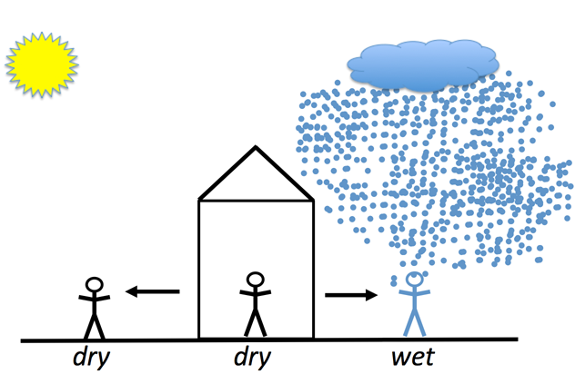
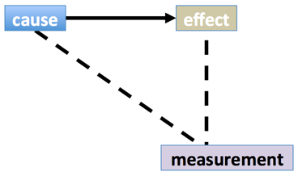
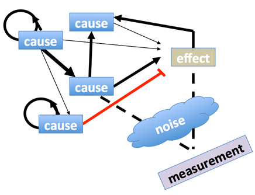
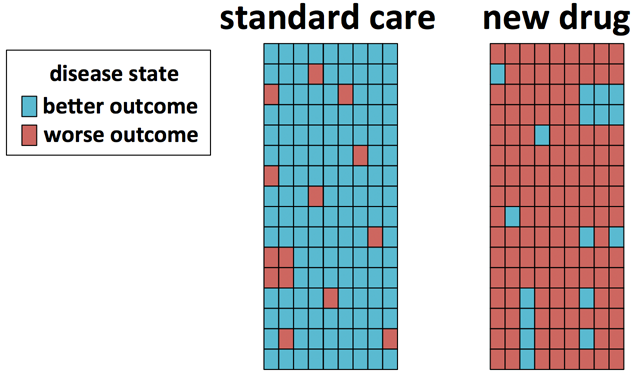
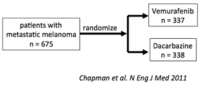
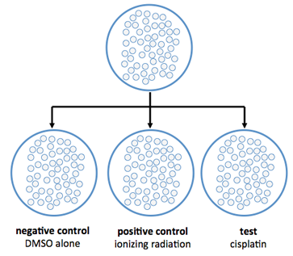

[Return to the table of contents](index.html)

********************************************************************************

Interventional studies and causality
==================================================

Statistical inference and causal reasoning
--------------------------------------------------------------------------------

Biomedical research questions are often framed as a question about causality:

* Does the drug cyclopamine inhibit signaling through the Hedgehog pathway?
    + If so, is this drug's activity responsible for the monocular phenotype of developing mammals exposed to cyclopamine?
* Does consumption of more than five alcoholic beverages a week increase the risk of developing liver cancer?
* Is Alzheimer's Disease caused by accumulation of amyloid beta-peptide plaque deposits in the brain?


An intuitive definition for causaliy
--------------------------------------------------------------------------------

Observational studies can estimate a value for a population from a sample. They can also estimate the strength of association between two or more attributes. This means they can answer questions such as, "what is the typical age of menarche?" or "how often do heavy smokers also have chronic obstructive pulmonary disease?" They generally cannot directly answer questions of causality, such as "does smoking cigarettes cause liver cancer?" Although statistical methods have been developed to infer causality from observational studies using probabalistic models (e.g. Bayesian graphical models), these methods are complex and will not be described in this course. In most settings, inferring causality requires an intervention. 

The term *causality* is philosophically complicated. Outside of philosophy, most of us are satisfied with a practical definition of causality: two events are causally related if the occurrence of one event has influence over the occurence of the other event. If my daughter Charlotte is dry when she stays in the house, and is dry when she goes out on a sunny day, but gets wet when she walks outside into the rainstorm, then this strongly suggests that Charlotte got wet **because** she went outside in the rain. 



**Figure 1: Charlotte walks into the rain**

The relationship between *walking outside into the rainstorm* and *getting wet* has a direction:

**Waking outside into the rain** $\large{\rightarrow}$ **getting wet**

We would not infer from this example that getting wet causes people to walk out into rainstorms.

The fact we saw Charlotte start out dry, then walk outside, and then get wet is key to our feeling about causality in this example. This introduces two key elements: the elements of **time** and of **intervention**. We saw a girl who was dry, she intervened in the world by walking outside, and then we observed the consequence.  



**Figure 2: Simple causal model**

Figure 2 is the kind of cartoon, common in the biomedical literature, that draws direct causal connections between an intervention and a response. This sort of figure is often the last part of a paper or talk, when the investigators sum up their view of how various interventions cause effects.

We know that reality is always more complex than these simple drawings. Feedback and feed-forward loops of influence exist. Every system has  unknown and unmeasured causes. Effect sizes are variable and have varying directions. Causal relationships can be conditional on a particular constellation of other influences. All measurements are made in the presence of noise and bias.

Living systems are influenced by multiple unknown causes of varying strength, that combine and possibly interact, producing effects of varying strength. These effects may not be immediately apparent, or they may be observable only though secondary phenomena. In some cases, the nature of the effect and the subject (e.g. factors affecting infant mortality rates, or adult suicide) make it unethical to study the questions in the most direct, informative manner. In those cases, we must observe the natural world, or intervene by attempting to produce a better outcome without withholding a factor known to be beneficial.



**Figure 4: Slightly more realistic model**


Interventional studies
================================================================================

Intervention studies are designed to test the effects of one or more specific treatments (interventions) on subject outcomes. The key distinction between intervention and observational studies is the deliberate application of the intervention to the study population. Most laboratory experiments are intervention studies. Laboratory studies can minimize unwanted variation by using genetically and environmentally homogeneous subjects, such as inbred mice or yeast grown in uniform conditions. This uniformity allows the researcher to maximize control over undersirable confounding variables.

Humans are heterogeneous, and attempting to perform interventions in humans without some means of mitigating that heterogeniety risks incurring all of the sampling problems described previously.



**Figure 5: an unrandomized clinical trial**

The best known approach is to obtain a necessarily heterogeneous human population and then randomize the application of the treatment. Although unobserved and potentially unknown elements will still affect the outcome of the study, proper randomization should distribute the effects of these elements among both treated and untreated subjects. This should prevent these elements from becoming confounded with case or control assigmnent.

To illustrate the potential benefits of randomization, **Figure 5** illustrates an unrandomized trial design where a drug is tested on one population while a control population receives a the standard care regime. However, unbeknownst to the investigators, the patients who were chosen for the standard of care arm are likely for some other reason to have a better outcome even without any treatment. Because of this confounding, the trial is biased against the new drug, or indeed any other treatment in the second group of patients.

The randomized clinical trial
------------------------------------

Some intervention designs, such as the randomized clinical trial (RCT), can eliminate sampling bias and allow for causal interpretation of the results. As noted in [Module 1.3](module_01.3.html), case-control studies are subject to confounding due to factors such as selection bias. To break the link between these confounding influences and the intervention, randomized controlled trials prospectively obtain subjects and then randomly assign those subjects to receive either the treatment or a sham intervention called a placebo. In some settings it would be unethical to give patients a placebo, so the intervention under investigation must be compared to the current standard of care.


**Figure 6: a randomized clinical trial design**

The randomization is the key element in the RCT design. If, for example, women respond at double the rate of men to a drug intervention, a RCT trial can safely include both women and men so long as women are as likely to wind up in the control arm as the treatment arm. 

Some studies examine the effects of an exposure on **groups of subjects**, rather than on individual subjects. Testing whether the addition of fluoride to a population's drinking water affects the propensity to develop cavities is such a group exposure study. Randomization is performed on the unit that undergoes the intervention. Comparison of one community with fluoridated drinking water to another community without fluoride does not allow for randomization, even if there are tens of thousands of individuals in each community, because there are only two exposure units.  

After a randomized clinical trial has been completed, it is still necessary to assess the distribution of any known confounding variables between the treated and untreated groups. Confounding variables can be assigned in unequal proportions by chance, although it is possible to control for this using stratified analysis or regression.


Example: A trial of vemurafenib 
================================================================================

As an example of a randomized clinical trial, consider a recent study of patients with metastatic melanoma. This disease is historally lethal and resistant to radiation and chemotherapies. The growth of some melanoma tumors is driven by an activating mutation in the *BRAF* gene, causing abnormal activation of growth signaling. The drug vemurafenib was developed to specifically block the activity of cells with this mutated version of *BRAF*. The vemurafinib trial was designed to answer the question, would vemurafenib prolong patient survival when compared to the dacarbazine, the only chemotherapy approved at the time for these patients?

To conduct and interpret this study, a number of questions that require biostatistics must be answered, including

* how many patients should be tested?
* what is an appropriate study design?
* was there a meaningful difference between patients treated with dacarbazine and those treated with vemurafenib?

In this study, a power calculation was performed to determine that 675 patients should be enrolled. Patients were then randomized to receive either dacarbazine or vemurafenib.



**Figure 7: experimental design in a RCT, Chapman *et al* **

The investigators performed a *post-hoc* analysis of whether certain factors, such as the extent of metastasis, were successfully randomized between the study arms. These data are usually presented in a table. Be aware that any confounding factors that are unknown, or known but not tested, may still affect the experiment.

The vemurafinib trial was so successful that the trial was stopped at a pre-planned analysis point mid-way through the trial, to allow patients in the control arm to switch onto drug. 

Laboratory studies
================================================================================

We mentioned in the module on sampling that in studies of naturally occurring phenomena it usually impossible to collect data on the entire population of interest. Consequently, scientific research typically relies on selecting a sample of this population and studying the phenomenon within this sample. We wish to perform some combination of **observation** and **intervention** among the members of this sample population. Epidemiology is the study of disease in human populations, and in these cases the samples must be acquired by finding the right people at the right time. In the laboratory fields of molecular biology and genetics, it is often possible to create the sample population we would like to use from model organisms. However, the same analytical principles will apply.

Controls in experimental science
--------------------------------------------------------------------------------

One benefit of laboratory studies is the opportunity to reduce systematic differences between treated and control samples. Laboratory science distinguishes between *positive controls* and  *negative controls*. A positive control does not receieve the treatment under study; it receives a different treatment that has been previously shown to elicit the response under investigation. The negative control is handled identically to the actual treatment condition, but the intervention under study is left out. 

The negative control for cell lines that will be exposed to a drug that has been dissolved in a liquid vehicle (such as the substance DMSO) is plain DMSO lacking drug; this condition is sometimes referred to as the "vehicle" condition. For studies involving a surgical intervention or some other physical manipulation, the negative control is a sham surgery.


Example: Does a drug kill cancer cells?
--------------------------------------------------------------------------------

The growth and behavior of a cell is influenced by strong feedback mechanisms that originate both within the cell and from the environment outside of the cells. Normally functioning cells possess feedback systems that prevent them from growing in way that would compromise their function. Cells monitor their own health, and can shut down or even commit suicide if they are damaged beyond repair. However, if the feedback systems that control cell growth are damaged, cells can grow inappropriately, resulting in a malignant tumor. Malignant tumors, which spread out of their local envionment, are a major source of human disease and mortality.

Investigators studying the mechanism of chemotherapy might design an experiment to determine whether an experimental chemotherapy is an effective way to kill tumor cells. To model cancer in a human patient, they using cells isolated from a patient's tumor that will grow on on plastic dishes. The cells, grown from a single clone, are fed appropriate nutrients in a defined broth, and will continue to divide indefinitely. The cells are meant to model what is going on inside of the tumor from which they were derived. The drug of interest may kill the cells, or it may do nothing. If the drug kills the cells, that would be a first step on a long series of investigations that might result in identifying a new treatment. The **hypothesis**, broadly stated, is that "exposing tumor cells of this type to the drug will kill them". In reality one must be more specific: how much drug, for how long, under what conditions.

The process is to seed the same number of cells into plastic dishes and treat the cells with either drug dissolved in vehicle or just vehicle alone. As a positive control, the cells are treated with another drug known to be lethal to cells. The experimenter then waits and counts the number of viable cells under each condition.



**Figure 8: simplified design of a cell treatment experiment**

Naively we might imagine that a single test can be performed: split a dish of cells in half, treat with either drug or vehicle, and count the number of viable cells in each dish. 

This example is one of the most carefully controlled situations in biomedical research. The population under study is a single-celled organism that lives in a temperature- and atmospherically-controlled incubator, consuming only nutrient broth we supply. The stimulus will be precisely measured drug stimulus given at the time and dose we choose. Drugs can be formulated by a single person and all organisms are treated under the same regime. By starting with a single cell and growing out a colony of replicate cells, it is possible to reduce the genetic and inter-subject variability compared to studying natural populations of organisms. 

Unfortunately, this project is fraught with unintended variability. Some variability stems from technical problems with the manipulations, while other variablity stems from the cells themselves.

**Technical variability** includes:

* The number of cells starting in each dish is different
    + This will affect any perceived change in cell population after treatment
    + Cell growth is affected by the population density and chemical substances secreted by neighboring cells
* The cell counts are imprecise. 
* As the cells fill the dish, they grow less quickly
* If we must expose the cells to drug for several days, we may have to change out the medium in which they are growing, disturbing the cells and introducing variable amounts of drug
* Cells seeded at the edge of the dish may tend to grow faster or slower than those in the middle
* Cells in different parts of the incubator may be hotter or cooler than others

**Biological variability** includes:

* The internal state of the cells is not identical. 
    + At any given time point, cells will be in different phases of the growth cycle
    + Cells are exposed to varying levels of nutrients and drug.
* The cells themselves will not remain genetically identical; they constantly undergo DNA damage, leading to sub-populations that grow at distinct rates and react distinctly to stimuli.


```{r echo=FALSE, fig.width=5, fig.height=4}
par(mar=c(4,4,2,2))
veh =  c(123882,106883,50919,74551,118046,38686,132710,87012,110617,89205)
drug = c(81399,59396,77027,29396,40791,40224,48185,54700,50314,67893)
results = 1:20
results[ seq(from=1, to=19, by=2) ] = veh
results[ seq(from=2, to=20, by=2) ] = drug
colors = rep(c("black", "cornflowerblue"), 10)
rr = results
rr[3:20]=0
barplot(rr, col=colors, space=c(0, 0,1,0,1,0,1,0,1,0,1,0,1,0,1,0,1,0, 1, 0),  
        xlab="replication", ylab="number of cells", ylim=c(0, 166000), axes=FALSE )
lbls = c( "0", "2e4", "4e4", "6e4", "8e4", "1e5", "1.2e5", "1.4e5" )
axis(2, at=seq(from=0, to=140000, by=20000), labels=lbls, las=1 )
axis(1, at=seq(from=1, to=30, by=3), labels=1:10, las=1 )
legend(22, 1.65e5, c("Vehicle","Drug"), col=c("black", "cornflowerblue"), pch=19)

```

**Figure 9: the first replication**

After the experiment is complete, the number of surviving cells is recorded (**Figure 9**). Here the height of each bar represents the number of cells remaining in the petri dish after treatment with vehicle control (black) or drug (blue), 

If we repeat the experiment more than once, we will report different answers.

```{r echo=FALSE, fig.width=5, fig.height=4}
barplot(results[1:12], col=colors, space=c(0, 0,1, 0,1, 0,1, 0,1, 0,1, 0,1, 0,1, 0,1, 0,1, 0)[1:12],  
        xlab="replication", ylab="number of cells", ylim=c(0, 166000), axes=FALSE )
lbls = c( "0", "2e4", "4e4", "6e4", "8e4", "1e5", "1.2e5", "1.4e5" )
axis(2, at=seq(from=0, to=140000, by=20000), labels=lbls, las=1 )
axis(1, at=seq(from=1, to=30, by=3), labels=1:10, las=1 )
legend(10, 1.65e5, c("Vehicle","Drug"), col=c("black", "cornflowerblue"), pch=19)
```

**Figure 10: six replications**

Here we show six repetitions of the experiment. Many of the replications appears to show a convincing effect of the drug on cell viability. However, replication six shows no apparent effect, and replication three shows the effect in the opposite direction. Which is the correct answer? Intuitively, if we look across the experimental results, it appears that black bars are generally taller than their blue counterparts. However, some experiments appear to show no effect, or even (as in replication 3) the reverse effect.

In order to determine whether there is evidence that the drug causes cell death, we will need to learn some biostatistics.


Summary
===========

* Randomizied trials
    + reduce sampling bias
    + allow for causal interpretation
* Laboratory experiments still subject to bias and noise
    + negative controls isolate specific treatment from other manipulations
    + positive controls show the effect can be detected in your hands

