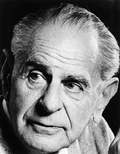

*In this module, I will briefly introduce the history of scientific thinking about whether we can prove a hypothesis about the natural world to be correct. Popper's contention that positive proof of a hypothesis cannot be obtained, and the central role of falsifiability, will motivate the P value.*

The scientific method and proof
=================================================

A practical reason to study the philosophy of science
------------------------------------------------------

What does it mean to prove a biological hypothesis to be true? Is experimental research that investigating the natural world similar in a strong sense to what mathematicians do when they explore the bounds of mathematics? 

Thinking about what it means to prove a fact, and whether it is even possible to establish a claim about the natural world to be true, is a problem that philosophers have been struggling with for centuries. That might seem rather far removed from the day to day concerns of a molecular biologist or clinical researcher, but there are good reasons to spend some time with these ideas. 

The first, fundamental reason for considering this issue is that thinking carefully about what it means to prove a fact to be true, and considering that it might not be possible to do so, has deep implications for how we think about what we are doing day to day. It affects how we talk and think about study designs, and how we interpret results. 

The second, practical reason for thinking about proof is that grappling with this issue is the only way to understand what a *P* value is. Many experimental scientists work with *P* values and the hypothesis testing framework, and many of those scientists don’t have a clear understanding of what a *P* value actually is. They know it’s good when *P* values are low, and that they give some information about whether a result would be seen by chance. The idea behind the *P* value, and therefore behind much of a biomedical researcher’s relationship to quantitative measures of an experiment, remains somewhat counter-intuitive. It takes practice before it becomes second nature.

One formulation for the general process of the scientific method is that we make specific observations and then generalize these observations into models and even into laws. Some philosophers, such as David Hume, had a fundamental concern with this. We can think about their concern using a simple example. If we visit a lake crowded with birds day after day and only ever observe white swans, we may be tempted to make the induction that all swans are white. 

What, is our assurance that there is no such creature as a black swan? Unlike mathematics, where one can define axioms and create a completely consistent world from those axioms, natural phenomena are not created by our hands. Since the color of swans is determined by our experience in nature and not an internally consistent logical system derived from axioms, how could we ever formally prove a fact to be true about the world? It takes only a single black swan to invalidate the hypothesis, and there may always be a black swan hiding around the corner. 

Can we prove a hypothesis to be false?
------------------------------------------------------

Karl was a philosopher of science who grappled with this problem. One of his best-known tenets is that in order to qualify as a scientific inquiry, **"it must be possible for an empirical scientific system to be refuted by experience"** (*The Logic of Scientific Discovery*). By this formulation, a statement that cannot be proved false- a statement that is not falsifiable--  is not a scientific statement. Popper argued that we cannot prove a hypothesis about the natural world to be true in a deep, formal sense. The existence of a single black swan disproves the idea that all swans are white. This idea-- that we can prove a hypothesis to be false, but not to be true-- is important because it is a powerful formulation of what we are doing as scientists. 

It is also how the null hypothesis statistical testing works. One reason this is counter-intuitive is that we generally don’t think of ourselves as providing evidence that things to be false.

As a practical example, we might hypothesize in the laboratory that treating cells in culture with olaparib, a drug that inhibits activity of the protein PARP, would selectively kill cells that cannot make the protein BRCA1. As a test, we treat those cells with olaparib and with a control that contains no PARP inhibitor. We then measure the effect on cells treated with either drug or control and make a judgement about the accuracy of our hypothesis. 

From a statistical and formal point of view, after stating our hypothesis that the intervention of olaparib will cause an effect, we then test a different hypothesis: **that there is no such effect**. We say, “if this model were false, then I would expect treating the cells with drug to have no effect. I’ll test the hypothesis that treatment has no effect. If I see an effect, my hypothesis is not supported.” This may seem like a strange way to go about things, but it is a natural consequence of the idea that we cannot positively prove the presence of an effect. In the jargon of statistics, **the hypothesis that no effect is present is called the null hypothesis**.

Note that strong evidence that olaparib kills BRCA1-null cells *does not disprove* the null hypothesis, in a formal sense. It does have show that it is *very unlikely to be true*.

Measurements of events that take place in the natural world are not identical, due to real biological variation and the imperfections in our instruments. The effect of our drug treatment is therefore a variable, and a very practical use of statistics is to answer the question, what is the strength of evidence against our negative or null hypothesis? The *P* value is one way to answer that question.

The P value
==================

The P value is defined as follows: P is **the probability of observing an effect as large or larger than observed, if the null hypothesis were true**. We can break this definition into several pieces and understand them one by one.

* **The probability of observing...**
    + P is a probability. I will briefly describe the mechanics of probability, because along with its informal meaning probability has a specific formal meaning and we can do arithmetic with probabilities.

* **...an effect as large or larger than observed...**
    + P depends on both effect size and sample size.

* **if the null hypothesis were true?**
    + P tests the assumption that the null hypothesis is true. It does not test the assumption that the alternate hypothesis is true. This goes back to Popper and the black swan problem.

In testing properties of the natural world we often measure something with a continuous effect size: patient lifespan, the deviation from expected frequency of a trait among fruit flies, the growth rate of a cell. Our experimental results must therefore be tested using a model that produces a statistic that reflects the difference in this effect size and the consistency of the difference. We then need a way to ask, what is “the probability of observing an effect as large or larger than observed if the null hypothesis were true?” This is, not coincidentally, the definition of a P value. 

Where did P < 0.05 come from?
================================================

Now that we have a way to quantify the likelihood of an event, we can use that tool to reason about the outcome of scientific experiments. One of the first people to do this was Sir Ronald Fisher, who invented much of modern statistics. Much of Fisher’s work was developed to evaluate agricultural experiments. A typical experiment might ask whether using a new fertilizer resulted in larger harvests of wheat. It would take a whole season to learn the result of a single trial, providing a strong incentive to design efficient trials. Fisher developed the P value as a tool for evaluating the strength of evidence against the null hypothesis; that is, the hypothesis that an intervention had no effect. Quoting one of his early writings gives a clue to a question that many people ask: what is so special about P < 0.05? 

>“If one in twenty does not seem high enough odds, we may, if we prefer it, draw the line at one in fifty (the 2 per cent point) or one in a hundred (the 1 per cent point). Personally, the writer prefers to set a low standard of significance at the 5 percent point... A scientific fact should be regarded as experimentally established only if a properly designed experiment rarely fails to give this level of significance.” 
(*Statistical Methods for Research Workers*)

So this is the essential origin of P < 0.05. There is no deep statistical theory that judges this level of statistical significance to be particularly important. Fisher’s argument was that low P values, in repeated experiments, were interesting and unlikely to be seen in the absence of a real effect. There are several points to make here. First, that using Fisher’s method, a P value is a tool used for *post hoc* interpretation of the results of an experiment. This interpretation was continuous, with no cut-off value determining a decision point. The P value here is used for inference, not for a decision procedure. A P value of 0.048 would be interpreted as nearly indistinguishable from a P value of 0.052.

Making decisions with P values: hypothesis testing
===============================================================

A subsequent use of P values was popularized by Neyman and Pearson, who developed a hypothesis testing framework. This framework, which was so widely adopted that many people think of it as the only way to do statistics, uses P values to make a decision. Here a particular P value is set before the experiment is performed. This P value, which has the technical name of alpha, is set as a cut-off. The most familiar alpha level is 0.05, but any value could in principle be used. Deciding on an alpha level for decision-making has several useful implications. The first, most obvious one, is that there is clarity about what to do with the results of a statistical interpretation. This is particularly important in very large, expensive experiments such as clinical trials, where the parties performing the experiment may have a vested financial interest in the results. In this framework, given an alpha level of 0.05, a result where P = 0.048 has very different implications from P = 0.052.

Another important implication is that it is possible to plan about how frequently one is willing to make two distinct types of mistakes. The first mistake is to reject the hypothesis of no effect, that is the null hypothesis, when in fact the truth of the matter is the intervention had no effect. This error, technically referred to as a Type One error by Neyman and Pearson, can be though of as, “I shouldn’t have published that result”. The second sort of error comes from incorrectly failing to reject the null hypothesis; that is, to miss a real effect.  This error is technically referred to as a Type Two error, and can be though of as, “I missed the result and could have published it.” 

There is a trade-off between the likelihood of making a type one and type two error; with greater statistical stringency we reduce the chances of type one and increase the chances of type two. The type two error is quantified by statistical power, which has the technical name of beta. Like the alpha, the beta is also a percentage. It represents the percentage of the time one will correctly reject the null hypothesis of no effect. Given a statistical model, alpha and beta levels, and an expected effect size, one can plan how many individual subjects to include in the study. A common formulation is to ask, “how many replicate samples must I include in my study to have an 80% power to detect an effect of given size, rejecting the null hypothesis at a 5% alpha level?” 

Critiques of the P value
===============================================================

Although the use of a particular P value cut-off has been justifiably criticized as arbitrary, the ability to make power calculations, and to interpret positive and negative results in light of the power available to perform a test, is extremely valuable. 

Another critique of the P value cannot be as easily answered, and that is that P values are not the same as effect sizes. We are generally interested in the size of an effect, whether that effect measures the result of an intervention or the association between two variables. P values are a function of both effect size and sample size. By increasing the sample size, one can drive the P value arbitrarily low, even when the effect size is too small to be meaningful. It is likewise the case that even in the presence of a truly strong effect, very small sample sizes will result in large P values. 

