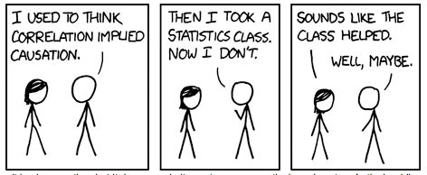

```{r global_options, include=FALSE}
knitr::opts_chunk$set(comment = NA)
knitr::opts_chunk$set( prompt=TRUE ) 

knitr::knit_hooks$set(small.mar = function(before, options, envir) {
    if (before) par(mar = c(2, 2, 1, 1))  # smaller margin on top and right
})

knitr::knit_hooks$set(med.mar = function(before, options, envir) {
    if (before) par(mar = c(4, 4, 1, 1))  # smaller margin on top and right
})

```
*This module introduces correlation as a measure of the association between two variables. It shows how correlation is derived from covariance, how to calculate a P value for a correlation, and how to derive confidence intervals for correlation. It describes the limits of correlation.*

Correlation 
========================================================



*(XKCD, https://xkcd.com/552)*

The long fat mouse and the short thin mouse
--------------------------------------------


Suppose I gave you a list of 20 numbers and told you they were the lengths of 20 mice measured from the tips of their noses to the ends of their tails, and then asked you to rank the mice in order from heaviest to lightest without seeing them or getting any other information. 


```{r echo=FALSE, med.mar=TRUE, fig.height=3, fig.width=3}
weights=c(23.31,28.43,24.51,31.14,21.60,19.90,27.91,23.10,23.38,18.27,18.02,
          14.87,35.46,20.52,28.60,23.35,20.65,29.16,15.20,32.70)
lengths=c(166,197,189,192,178,167,181,189,191,173,173,172,193,190,193,185,172,195,148,199)
plot(sort( lengths ), xlab="mouse number", ylab="length (mm)", pch=19, las=1)
```

If you assumed that longer mice were heavier than shorter mice, you might guess their weights should be ranked by their lengths. If you did this, you would make some mistakes but do pretty well overall.

```{r echo=FALSE, med.mar=TRUE, fig.height=3, fig.width=5}
barplot( rank(weights)[ order(rank(lengths))], main="Weight rank order from lengths", las=1 )
```

Looking at some actual data, from an experiment using eight-week-old mice, it is clear that the longer a mouse was at eight weeks of age, the heavier it was likely to be. However, the relationship is not perfect.

```{r echo=FALSE, med.mar=TRUE, fig.height=3, fig.width=3}
plot(weights, lengths, xlab="Weight (grams)", ylab="length (mm)", pch=19, las=1)
```

The relationship between height and weight holds for humans as well, although there are many individuals who would violate our assumptions, such as very short and heavy men, or tall slim women. *Height and weight are correlated*; we could also say *there is an association between height and weight*. Correlation is a mathematical measure of the relationship between two continuous variables. Correlelation is appealingly simple, but correlation carries limitations and paradoxes that can trap the unwary. 


Correlation is derived from covariance
-------------------------------------------------

Correlation can be quantified numerically as a number called the *correlation coefficient*. To calculate this coefficient, we must first calculate a value with a very similar name: the *covariance*. Covariance measures how much two random continuous variables tend to change together. 

The mathematics of covariance depend on whether we are refering to the covariance of two *entire populations* of variables, or *samples* of those populations. Recall that a sample of the population is an estimate of value we would see if we could measure the entire population. In real-world analysis we obtain samples of the total population, and are therefore estimating the population covariance from what we can see in our samples.

If we are calculating on the entire population, the covariance of two variables is written as:

$\large{\textit{cov}_{X,Y} = \sigma_{X,Y} = E[(X-E[X])(Y-E[Y])] }$

E[X] means, "the expected value of X", and in this context it is equal to the mean value of X. We are asking, "as individual values of X get farther from the mean of X, do matching individual values of Y diverge from the mean of Y in a similar proportion?" If so, the covariance will be large, since the mean product of differences will be positive. If X and Y tend to move in opposite directions, we will be mutliplying a positive and negative number together and the covariance will tend to be negative. If differences are equally likely to be positive or negative, they will tend to cancel each other out, and the mean difference will be close to zero. 

```{r echo=FALSE, med.mar=TRUE, fig.height=3, fig.width=3}
aa = c(1,2,4,5,6,9)
bb = c(1.6,3,2,9,5.5,13)
mu.aa = mean(aa)
mu.bb = mean(bb)
plot(aa,bb,las=1,xlab="X", ylab="Y", pch=19, col="cornflowerblue", main="X - E[X]")
lines(c(mu.aa, mu.aa), c(0, 100), col="gray", lty=2)
for(i in 1:length(aa) ){
    lines(c(aa[i], mu.aa), c(bb[i], bb[i]), lty=1, col="gray")
}

plot(aa,bb,las=1,xlab="X", ylab="Y", pch=19, col="cornflowerblue", main="Y - E[Y]")
lines( c(0, 500), c(mu.bb, mu.bb), col="gray", lty=2)
for(i in 1:length(bb) ){
    lines( c(aa[i], aa[i]),  c(bb[i], mu.bb),lty=1, col="gray")
}

```

*distance from each point to the mean of points on the X and Y axis (drawn as a gray line)*

We usually wish to calculate the sample covariance. To calculate sample covariance, we divide the overall sum of products by N-1 rather than dividing by N. 

$\large{ \sigma_{X,Y} = \frac{1}{N-1}\sum_{1}^N( (x_i-\bar{x})(y_i-\bar{y}) ) }$

```{r echo=FALSE,  med.mar=TRUE, fig.height=3, fig.width=3}
plot(aa,bb,las=1,xlab="X", ylab="Y", pch=19, col="cornflowerblue", main=paste("covariance = ",cov(aa,bb),sep=""))
```


```{r echo=FALSE}
print( data.frame( X_minus_meanX=round( aa-mu.aa, 2), 
            Y_minus_meanY=round( bb-mu.bb, 2), 
            product = round( (aa-mu.aa)*(bb-mu.bb), 2) ) )

example.rho = sum( (aa-mu.aa)*(bb-mu.bb) ) / (length(aa)-1)
```

Sum of products: `r round(sum((aa-mu.aa)*(bb-mu.bb)),2)`.
Sum of products / (N-1): `r round(sum((aa-mu.aa)*(bb-mu.bb))/( length(aa)-1),2 )`.

> The sample covariance of two vectors can be calculated in R using the cov() function.

Why don't we just use the covariance?
------------------------------------------------------------------

One disadvantage of the covariance is it is dependent on the magnitude of individual values of X and Y.

```{r echo=FALSE, med.mar=TRUE, fig.height=3, fig.width=3}
plot(aa,bb,las=1,xlab="X", ylab="Y", pch=19, col="cornflowerblue", main=paste("covariance =",cov(aa,bb),sep=" "))
plot(aa*10,bb*10,las=1,xlab="X", ylab="Y", pch=19, col="cornflowerblue", main=paste("covariance =",cov(aa*10,bb*10),sep=" ") )
```

Note that the values on the right bear the identical relationship to each other as the values on the left, but the values on the right are all larger than those on the left by a factor of 10. **Covariance is not standardized to a consistent range** between -1 and 1; it can be infinitely high or low. This makes it hard to compare two covariance measurements.

The Pearson correlation coefficient
================================================================

To obtain a consistent, standard measure of covariance we can use Pearson's correlation coefficient. Pearson's correlation, formally called Pearson's Product-Moment correlation coefficient, is sometimes written as the Greek letter ρ (rho). It is is calculated as:

$\large{ \rho = \frac{\textit{ covariance(x,y)} }{\sigma_x \sigma_y} }$

where $\sigma_x$ means the standard deviation of x and the covariance is as described above. The denominator (bottom) term in this equation will scale in proportion to the total amount of variation in the X and Y distributions. The denominator forces rho to be bounded between -1 and 1, inclusive; in the jargon, we say that the denominator standardizes the covariance measure. 

```{r med.mar=TRUE, echo=FALSE, fig.height=2, fig.width=2}

pches = c( rep(19, 10), rep(1,10))
colors = c( rep("cornflowerblue", 10), rep("black",10))
xs = c(1:10, 1:10)

va = 1:10
vb = 1:10+1
par(mar = c(3, 3, 1, 1))  # smaller margin on top and right


plot(1:20, 1:20, pch=19, col="cornflowerblue", xlab="X", ylab="Y", axes=FALSE, main="rho = 1.0", mgp=c(0.5,1,0.5) )
box()

plot(1:20, 20:1, pch=19, col="cornflowerblue", xlab="X", ylab="Y", axes=FALSE, main="rho = -1.0", mgp=c(0.5,1,0.5) )
box()

vb = rep(5,10)
plot(1:20, rep(10,20), pch=19, col="cornflowerblue", xlab="X", ylab="Y", axes=FALSE, main="rho = 0", mgp=c(0.5,1,0.5) )
box()
```

*correlation between two variables*

Using the definition of sample covariance from above, and the definition of the sample standard deviation defined in module 3.2, the correlation coefficient is equal to:

$\large{ \sigma_x = \sqrt{ \frac{ \sum_{i=1}^N(X_i-\bar{X})^2} { N-1 } }  }$

$\large{\rho = \frac{ \frac{1}{N-1}\sum_{1}^N( (x_i-\bar{x})(y_i-\bar{y}) ) }{ \sqrt{ \frac{ \sum_{i=1}^N(X_i-\bar{X})^2} { N-1 } } \sqrt{ \frac{ \sum_{i=1}^N(Y_i-\bar{Y})^2} { N-1 } } } }$

For the whole population, the equivalent calculation would be:

$\large{\rho = \frac{ \sum_{i=1}^N(X_i - \bar{X})(Y_i - \bar{Y})  }{  \sqrt{ \sum_{i=1}^N(X_i-\bar{X})^2} \sqrt{ \sum_{i=1}^N(Y_i-\bar{Y})^2}  } }$

```{r echo=FALSE, med.mar=TRUE, fig.height=3, fig.width=3}
example.rho = cor.test(aa,bb)$estimate
plot(aa,bb,las=1,xlab="X", ylab="Y", pch=19, col="cornflowerblue", main=paste("rho =", round( example.rho, 2),sep=" "))
plot(aa*10,bb*10,las=1,xlab="X", ylab="Y", pch=19, col="cornflowerblue", main=paste("rho =", round( cor.test(aa*10,bb*10)$estimate, 2),sep=" ") )
```

> Pearson's correlation coefficent can be calculated in R with the *cor()* function.

```{r}
x = c(1,2,4,5,6,9)
y = c(1.6,3,2,9,5.5,13)
cor( x, y )
```


Assessing the statistical strength of correlation
========================================================

calculating a P value for Pearson's correlation
--------------------------------------------------------

We can assess the statistical strength of a correlation using the null hypothesis testing framework introduced in module 4.1. The simplest and most natural null hypothesis for correlation is that correlation equals zero. This hypothesis is a polite fiction. In any non-trivial data set, it is almost impossible for correlation to be equal to precicisely zero. However, this fiction is still very useful, because it allows for a principled answer to the question of how likely it would be to see a particular correlation value by chance.

We are often interested in more than one continuous variable at a time. In some cases this is incidental: an experiment designed to measure the effect of nutritional supplements on mouse litter sizes may also capture information about the weight of each mouse. In some cases experiments are explicitly designed to measure the association between two variables

Calculate a t statistic from the rho value:

$\large{t = r\sqrt{\frac{n-2}{1-r^2}}}$

```{r echo=FALSE}
example.t = as.numeric( example.rho * sqrt( (length(aa)-2)/(1-example.rho^2)) )
```

In the case of our example above, with rho = `r round( example.rho, 3)`, the t statistic is `r round( example.t, 3)` with a corresponding P value of 
`r round( 2*( 1-pt(example.t, df=4) ), 3)`

```{r echo=FALSE}

bnd = 5
plot( seq(from=-bnd, to=bnd, by=0.01),  dt(seq(from=-bnd, to=bnd, by=0.01), df=length(aa)-2), 
    xlab="t statistic", main="t distribution", pch=19, cex=0.1, ylab="" )
for(i in seq(from=example.t, to=bnd, by=0.01)){
    lines(c( i,i ), c(0, dt(i, df=length(aa)-2)) )
    lines(c( -1*i,-1*i ), c(0, dt(i, df=length(aa)-2)) )
}
```

Recall that the P value corresponds to the area under the corresponding distribution that is as far or farther from zero than our test statstic. In the plot above, this is indicated by the shaded area of the t distribution. Both the positive and negative sides of the distribution are shared because a two-tailed test is used; we are testing the possibility that our t statistic could be either larger than zero, or less than zero.

Correlation testing in R
-----------------------------------

We can perform a correlation test in R using the *cor.test()* function. Called with only the two vectors, cor.test will print out the results of a correlation test:

> P values for Pearson's correlation can be calculated in R with the *cor.test()* function.

```{r}
x = c(1,2,4,5,6,9)
y = c(1.6,3,2,9,5.5,13)
cor.test( x, y )
```

After reminding us that a Pearson's product-moment correlation is being calculated, R reports the t statistic and the P value for that t statistic using a test with four degrees of freedom. There are four degrees of freedom because we can calculate the mean value of each vector, and so if we were given all but one of the values in x and y, we could calculate the remaining values. There are only six values to begin with, so that leaves four degrees of freedom.

R then reports a 95% confidence interval for rho, and finally reports the sample estimate for rho itself (0.8783637). To understand where the confidence interval comes from, we need to learn how to transform rho into a value that is normally distributed.

Obtaining confidence intervals for Pearson's product-moment correlation
---------------------------------------------------------------------------------------------

Convert correlation coefficients to Z scores

$\large{ z = \frac{1}{2}ln(\frac{1+r}{1-r} ) }$

$\large{ se = \frac{1}{\sqrt{N-3}} }$

A Z score for the difference in these two values can be calculated with: 

$\large{ \textit{Z test} = \frac{Z_1 - Z_2}{ SE_{ZD} } }$

Recall that the null hypothesis is that correlation equals zero. For the example shown above:

$\large{ \rho = 0.88 }$

$\large{ z_{H1} = \frac{1}{2}ln(\frac{1+0.88}{1-0.88} ) = }$

$\large{ z_{H0} = \frac{1}{2}ln(\frac{1+0.0}{1-0.0} ) = 0}$

$\large{ se = \frac{1}{\sqrt{6-3}} } = 0.577$

$\large{ Z_{score} = \frac{1.293 - 0}{0.577} = 2.240}$

What percentage of a standard normal distribution lies between 2.24 and positive infinity, and between -2.24 and negative infinity?

Limitations of Correlation 
================================================================================

Linear relationships only, please
------------------------------------------------------------

Correlation can only detect linear relationships between variables. Pratically speaking, this means the relationship between the variables can be described by a function where the parameters are constants or multiplied by coefficients. When plotted, linear relationships will form a straight line.

Examples of non-linear relationships that correlation cannot capture adequately:

```{r echo=FALSE, small.mar=TRUE}

layout( matrix(1:4,2,2))
plot(sin( seq(from=0, to=pi*2, by=0.001)), pch=19, cex=0.25, axes=FALSE, xlab="", ylab="")
box()

plot( 0,0, col="white", xlim=c(-1,1), ylim=c(-1,1), axes=FALSE)
symbols(0,0,circles=c(0.6), inches=FALSE, lwd=2,  xlab="", ylab="", add=TRUE)
box()

plot( rnorm(100)+5, rnorm(100)+5, xlim=c(0, 20), ylim=c(0,20), axes=FALSE, xlab="", ylab="")
points( rnorm(100)+5, rnorm(100)+15 )
points( rnorm(100)+15, rnorm(100)+5 )
points( rnorm(100)+15, rnorm(100)+15 )
box()

plot(sin( seq(from=0, to=pi, by=0.001)), pch=19, cex=0.25, axes=FALSE, xlab="", ylab="")
box()

```

In some cases, correlation can capture part of the relationship between two variables, but only part of that relationship. This plot is an exponential function $\large{Y=2^X}$, so the Y and X coordinates are perfectly correlated if one knows the distribution. However, the correlation coefficient is only 0.51:

```{r echo=FALSE, small.mar=TRUE, fig.width=3, fig.height=3}
plot( 2^ seq(from=0, to=30, by=0.001), pch=19, cex=0.25, axes=FALSE, xlab="", ylab="", main="rho = 0.51")
box()
```

Correlation is highly susceptible to outliers
---------------------------------------------------

The plot on the left shows two variables with an inverse correlation. The plot on the right was generated by adding a single point to the distribution on the left, with the new point colored in black. This pathological case shows that a single outlier point can radically change the Pearson correlation, despite not representing the distribution as a whole. Strategies for detecting and coping with this situation will be described in Module 8.

```{r echo=FALSE, small.mar=TRUE, fig.height=3, fig.width=6 }
aa = c(rnorm(10)+3, 10)
bb = c(rnorm(10)+3, 10)
cols=c(rep("cornflowerblue", 10), "black")
layout(matrix(1:2,1,2))
c10 = cor.test(aa[1:10], bb[1:10])
c11 = cor.test(aa,bb)
cor.10 = round( c10$estimate, 3)
cor.11 = round( c11$estimate, 3)
p.10 = round( c10$p.value, 3)
p.11 = round( c11$p.value, 3)

plot(aa[1:10],bb[1:10], pch=19, col=cols[1:10], xlim=c(0,10), ylim=c(0,10), las=1, main=paste("rho =", cor.10,"P=",p.10))
plot(aa,bb, pch=19, col=cols, xlim=c(0,10), ylim=c(0,10), las=1, main=paste("rho =", cor.11,"P=",p.11))

```

Very different data can produce equivalent mean, variance, and correlation values in pathological circumstances. The following demonstration, called Anscombe's quartet after statistician Francis Anscombe, shows the importance of looking at the data.

```{r echo=FALSE}

one_x = c(10,8,13,9,11,14,6,4,12,7,5)
one_y = c(8.04,6.95,7.58,8.81,8.33,9.96,7.24,4.26,10.84,4.82,5.68)
two_x = c(10,8,13,9,11,14,6,4,12,7,5)
two_y = c(9.14,8.14,8.74,8.77,9.26,8.1,6.13,3.1,9.13,7.26,4.74)
three_x = c(10,8,13,9,11,14,6,4,12,7,5)
three_y = c(7.46,6.77,12.74,7.11,7.81,8.84,6.08,5.39,8.15,6.42,5.73)
four_x = c(8,8,8,8,8,8,8,19,8,8,8)
four_y = c(6.58,5.76,7.71,8.84,8.47,7.04,5.25,12.5,5.56,7.91,6.89)

layout(matrix(1:4,2,2))
par(mar=c(2,2,2,2))
plot(one_x, one_y, pch=19, col="cornflowerblue", xlab="", ylab="", las=1)
abline(lm(one_y~one_x))
plot(two_x, two_y, pch=19, col="cornflowerblue", xlab="", ylab="", las=1)
abline(lm(two_y~two_x))
plot(three_x, three_y, pch=19, col="cornflowerblue", xlab="", ylab="", las=1)
abline(lm(three_y~three_x))
plot(four_x, four_y, pch=19, col="cornflowerblue", xlab="", ylab="", las=1)
abline(lm(four_y~four_x))
```

These four plots all show pairs of data with the same mean (X=9, Y=7.5); the same sample variance (X=11, Y=4.122); the same same Pearson's correlation coefficient (0.816); and the same linear regression coefficients (Y = 3 + 0.5X).